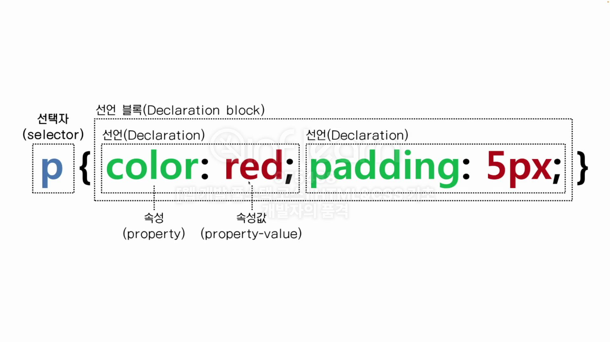

# publishing-prac-1
- 코딩웍스 [웹 개발 풀스택 코스] HTML&CSS 기초
- 생활코딩
## HTML (HyperText Mark-up Language)

## CSS (Cascading Style Sheets)
- HTML 문서 내에 HTML 태그를 선택해서 디자인하고 배치하는 역할을 한다.

### CSS 링크하기 - 내부 CSS 구문 작성
- html file `<head>`...`</head>` 사이에 `<style>`...`<style>`로 CSS 시작

### CSS 링크하기 - 외부 CSS 파일로 링크 후 CSS 구문 작성
- html 파일의 `<head>`...`</head>` 사이에 css 파일을 링크
- ex) index.ht크l 파일의 `<head>`...`</head>` 사이에 style.css를 링크

### CSS 기본 문법
- selector { declaration }
- selector { property  : value;}
-   h1     { font-size :   30;}

- 출처 : 코딩웍스